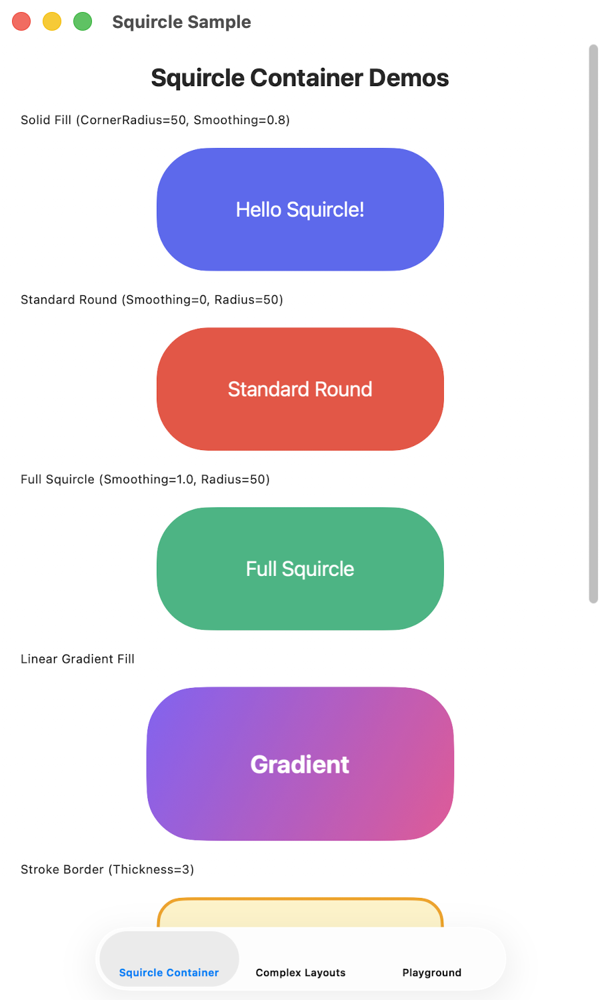
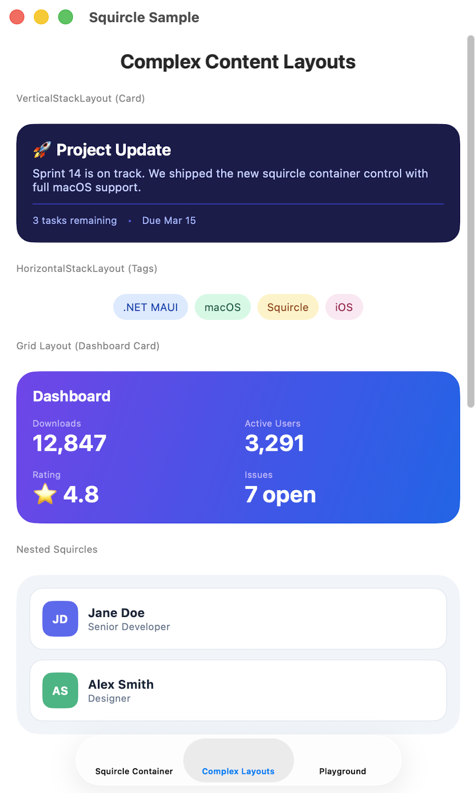
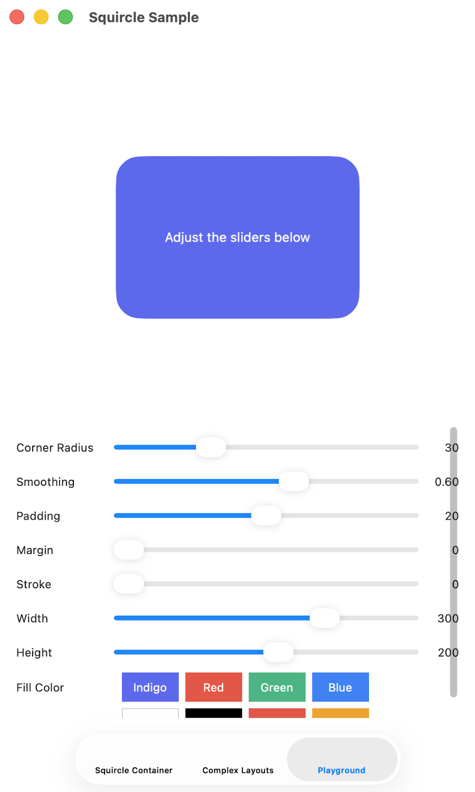

# Plugin.Maui.SquircleContainer

A .NET MAUI container control with Apple-style **squircle** (continuous-curvature) corners. Drop-in alternative to MAUI's `Border` control, but with smooth superellipse corners instead of circular arcs.

Uses only **MAUI Graphics** — no SkiaSharp or other drawing dependencies.

## Screenshots

| Basic Demos | Complex Layouts | Playground |
|:-:|:-:|:-:|
|  |  |  |

## What is a Squircle?

Standard rounded rectangles use circular arcs at corners, producing visible curvature discontinuities where the arc meets the straight edge. Apple's iOS uses **continuous-curvature corners** (superellipse/squircle shape) where curvature transitions smoothly, producing a more organic, visually pleasing shape. This is the same algorithm used by Figma's "corner smoothing" feature.

## Installation

```
dotnet add package Plugin.Maui.SquircleContainer
```

## Usage

### XAML

```xml
<ContentPage xmlns:squircle="clr-namespace:Plugin.Maui.SquircleContainer;assembly=Plugin.Maui.SquircleContainer">

    <!-- Basic squircle container -->
    <squircle:SquircleContainer CornerRadius="30"
                                CornerSmoothing="0.6"
                                HeightRequest="120"
                                WidthRequest="280">
        <squircle:SquircleContainer.Fill>
            <SolidColorBrush Color="#6366F1" />
        </squircle:SquircleContainer.Fill>
        <Label Text="Hello Squircle!"
               TextColor="White"
               HorizontalOptions="Center"
               VerticalOptions="Center" />
    </squircle:SquircleContainer>

    <!-- With gradient fill and border -->
    <squircle:SquircleContainer CornerRadius="40"
                                CornerSmoothing="0.6"
                                StrokeThickness="2">
        <squircle:SquircleContainer.Fill>
            <LinearGradientBrush StartPoint="0,0" EndPoint="1,1">
                <GradientStop Color="#8B5CF6" Offset="0" />
                <GradientStop Color="#EC4899" Offset="1" />
            </LinearGradientBrush>
        </squircle:SquircleContainer.Fill>
        <squircle:SquircleContainer.Stroke>
            <SolidColorBrush Color="White" />
        </squircle:SquircleContainer.Stroke>
        <Label Text="Gradient!" TextColor="White" />
    </squircle:SquircleContainer>

</ContentPage>
```

## Properties

| Property | Type | Default | Description |
|---|---|---|---|
| `CornerRadius` | `CornerRadius` | `0` | Per-corner radius values |
| `CornerSmoothing` | `double` | `0.6` | 0.0 = standard round, 1.0 = full squircle. 0.6 ≈ iOS |
| `Fill` | `Brush` | `null` | Background fill (solid, linear gradient, radial gradient) |
| `Stroke` | `Brush` | `null` | Border stroke brush |
| `StrokeThickness` | `double` | `0` | Border width |
| `StrokeDashPattern` | `float[]` | `null` | Dash pattern, e.g. `"8,4"` |
| `StrokeDashOffset` | `double` | `0` | Dash pattern offset |

## Corner Smoothing Values

| Value | Effect |
|---|---|
| `0.0` | Standard circular-arc rounded corners (same as `Border`) |
| `0.6` | Apple iOS-style continuous curvature (default) |
| `1.0` | Full superellipse squircle |

## Benchmarks

Performance comparison of `SquircleContainer` vs `Border` on real devices using [BenchmarkDotNet](https://benchmarkdotnet.org/) (Android) and a manual Stopwatch runner (iOS). All benchmarks use a 300×200 bounds with corner radius 16.

### Overall (End-to-End)

The rendering pipeline (build path/geometry + measure) and full lifecycle (create control + configure + render pipeline) show that **SquircleContainer is faster overall** because its geometry conversion savings outweigh the extra path-building cost:

| Benchmark | Android | iOS | vs Border |
|---|---|---|---|
| **SquircleContainer full pipeline** | 80.9 μs | 73.4 μs | **~0.65x (35% faster)** |
| Border full pipeline (baseline) | 127.2 μs | 111.7 μs | 1.00x |
| **SquircleContainer full lifecycle** | 216.7 μs | 198.0 μs | **~0.89x (11% faster)** |
| Border full lifecycle (baseline) | 245.3 μs | 219.3 μs | 1.00x |

### Individual Stages

<details>
<summary>Path Building (SquirclePathBuilder vs RoundRectangle)</summary>

Squircle math is more complex (cubic Bézier curves) than simple rounded rectangles:

| Method | Android | iOS | vs Border |
|---|---|---|---|
| SquirclePathBuilder (0.6 smoothing) | 4.1 μs | 5.3 μs | ~2.7x slower |
| RoundRectangle (baseline) | 1.6 μs | 1.9 μs | 1.0x |

</details>

<details>
<summary>Geometry Conversion (PathF→Geometry vs RoundRectangleGeometry)</summary>

Converting a PathF to a clip geometry is significantly faster than creating a RoundRectangleGeometry:

| Method | Android | iOS | vs Border |
|---|---|---|---|
| Squircle PathF → Geometry | 67.7 μs | 62.1 μs | **~0.59x (faster)** |
| RoundRectangleGeometry (baseline) | 115.3 μs | 101.9 μs | 1.0x |

</details>

<details>
<summary>Layout (Measure + Create)</summary>

Layout performance is nearly identical:

| Method | Android | iOS | vs Border |
|---|---|---|---|
| Measure | 163 ns | 160 ns | ~1.0x |
| Create + configure | 121 μs | 102 μs | ~1.13x |

</details>

> **Devices**: Android API 35 emulator (arm64), iPhone 16 Pro simulator (iOS 18.6).
> Run benchmarks yourself: `dotnet build benchmarks/ -f net10.0-android -t:Run`

## Algorithm

Based on the [Figma squircle algorithm](https://www.figma.com/blog/desperately-seeking-squircles/):
each corner is drawn as **two cubic Bézier curves** flanking a **circular arc**, with the arc sweep decreasing as smoothing increases. This produces G2-continuous (curvature-continuous) transitions between straight edges and rounded corners.

## License

MIT
